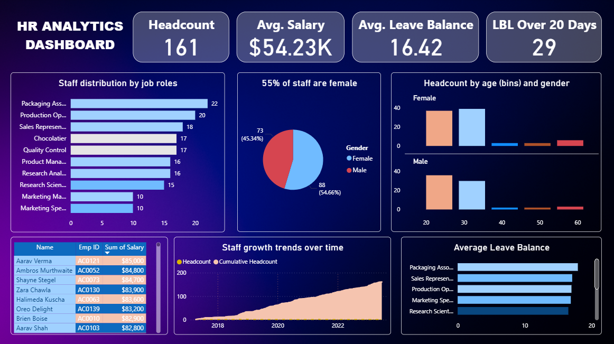

# 📊 HR Analytics Dashboard (Power BI)

## ✅ Project Overview
This project presents an **interactive HR Analytics Dashboard** built in **Power BI**.  
The dashboard provides valuable insights into workforce demographics, salary patterns, and HR trends to enable **data-driven decision-making**.

---

## 🔍 Key Features
✔ Staff distribution by job roles  
✔ Gender and age breakdown of employees  
✔ Salary distribution   
✔ Staff growth trend over time  
✔ Leave balance analysis    
✔ Quick HR Dashboard summary  

---

## 🛠 Tools & Technologies
- **Power BI** → For visualization and dashboarding  
- **Excel / CSV** → Data source  

---

## 📂 Files in this Repository
- `HR_Analytics.pbix` → Power BI dashboard file  
- `Staff_data.xlsx` → Sample HR dataset
- `/images/dashboard_preview.png` → Screenshot of the dashboard  
- `README.md` → Project documentation  

---

## 📷 Dashboard Preview

---

## 🚀 How to Use
1. Download the `.pbix` file from this repository  
2. Open it in **Power BI Desktop**  
3. Connect to your HR dataset (or use the sample provided)  
4. Explore interactive visualizations!  

---

## 🔗 Connect with Me
👤 **Shakiba Ansari**  
📌 Data Analyst | Power BI | Python | Excel  
🔗 [LinkedIn](www.linkedin.com/in/shakibaansari24)

---

⭐ If you found this project helpful, **star this repository**!
